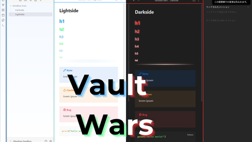

# Obsidian Wars

# Vault Wars

Vault Wars is a fan-made Star Wars™–inspired custom theme for Obsidian.  
Light mode channels the Jedi Order with blue and green accents, while Dark mode embraces the Sith with crimson highlights.  
Headings glow like lightsabers, horizontal rules shimmer like energy blades, and glowing borders tie the look together.

*Disclaimer: This is an unofficial, fan-made work.*  
*Star Wars™ and related properties are trademarks of Lucasfilm Ltd. This theme is not affiliated with, endorsed by, or sponsored by Lucasfilm Ltd. or The Walt Disney Company.*

---

## ✨ Features
- **Dynamic color scheme**  
  - Light Mode: Jedi (blue/green accents)  
  - Dark Mode: Sith (red accents)  
- **Lightsaber-style headings** with soft glow effects  
- **Blade-like horizontal rules** with subtle animation  
- **Sidebar & panel borders** that glow in theme colors  
- Accent colors for **links, backlinks, and interactive UI** based on mode  
- Fully responsive and works on desktop & mobile  
- **Ultra-lightweight build** – only **12KB total**, split evenly between the Jedi and the Sith (~6KB each).  
  *Even a podracer couldn’t load faster.*

---

## 📂 Installation
1. Download or clone this repository.  
2. Place the theme folder into your Vault's `.obsidian/themes/` directory.  
3. In Obsidian, go to **Settings → Appearance → Themes** and select **Vault Wars**.

---

## 🛠 Customization
You can tweak key variables in `theme.css`:

- `--ow-border-w` – Border/bars thickness  
- `--ow-glow` – Heading glow intensity  
- Accent color variables in `.theme-light` and `.theme-dark`  

---

## 📜 License
This theme is released under the **MIT License**.  
Feel free to modify and share, but please credit **AmyJapanese** as the original creator.

---

*May the Force™ be with your notes.*
